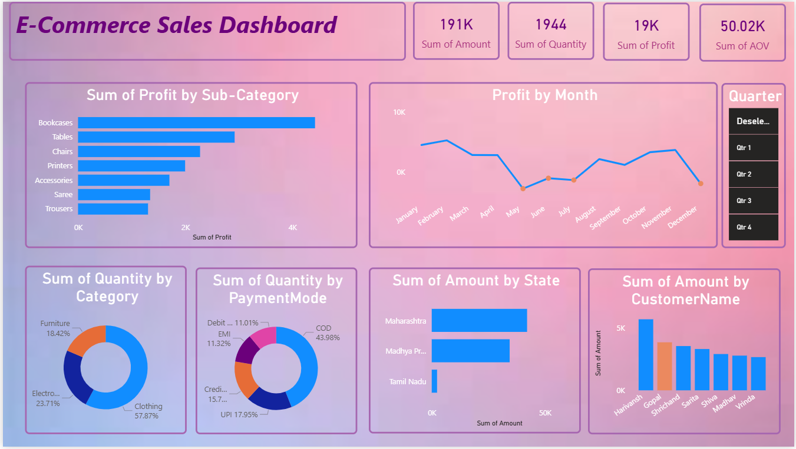

# 📊 E-Commerce Sales Dashboard

Welcome to the **E-Commerce Sales Dashboard** – a powerful business intelligence project designed to analyze and visualize key metrics of an e-commerce business using interactive dashboards.

---

## 🚀 Project Overview

This project aims to turn raw sales data into actionable insights through compelling visualizations. The dashboard offers a holistic view of:
- Sales & Profit trends
- Product performance by sub-category and category
- Customer purchasing behavior
- Payment mode distribution
- Geographical sales performance (by state)
- Monthly profit trends and more

---

## 🧠 Key Insights

📌 **Overall KPIs**
- 💰 Total Sales: ₹191K
- 📦 Total Quantity Sold: 1944
- 📈 Total Profit: ₹19K
- 🛒 Average Order Value (AOV): ₹50.02K

📌 **Top Performers**
- 🛋️ **Most Profitable Sub-Category**: Bookcases
- 👗 **Most Sold Category**: Clothing (57.87% of total quantity)
- 🌍 **Top State by Sales**: Maharashtra
- 👤 **Top Customer**: Harivansh
- 💳 **Top Payment Mode**: COD (43.98%)

📉 **Lowest Profit Months**: May & December

---

## 💼 Business Applications

This dashboard can be leveraged for:
- Inventory planning and product stocking
- Regional marketing strategies
- Customer segmentation
- Performance evaluation and forecasting
- Understanding seasonal trends

---

## 🛠️ Tools & Technologies

| Tool           | Purpose                      |
|----------------|------------------------------|
| Power BI  | Data Visualization & Dashboard |
| DAX Formulas        | Data Modeling & Metrics         |

---

## 📸 Dashboard Preview

---
